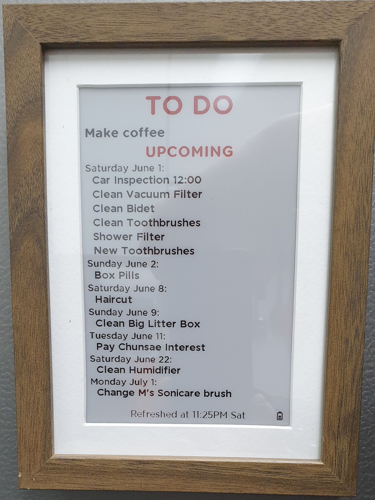
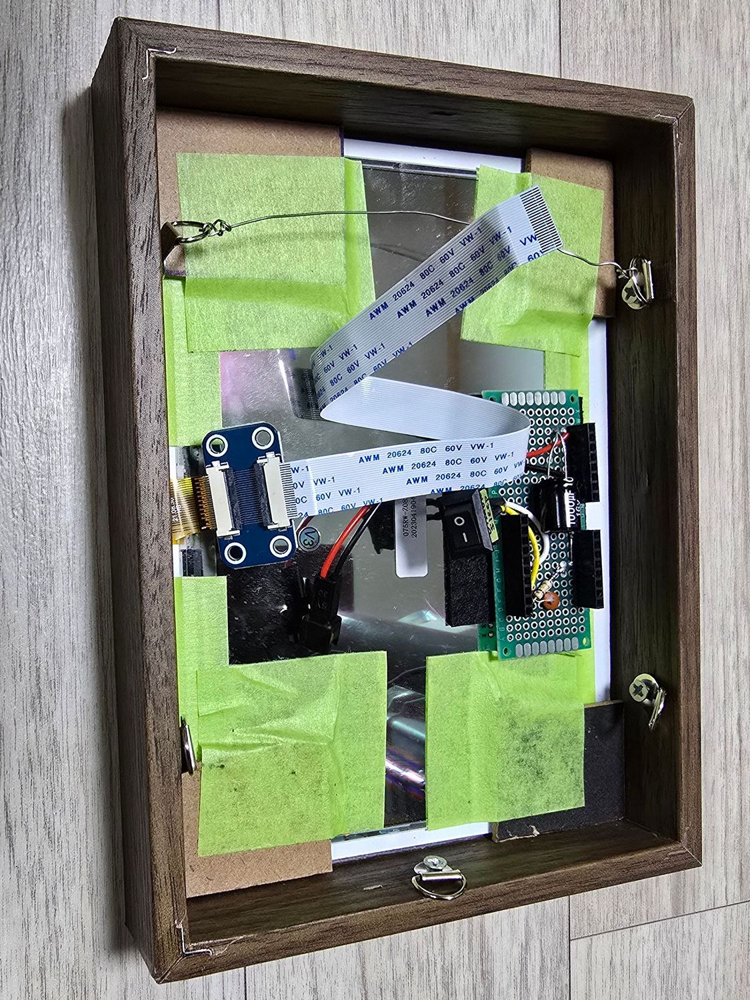
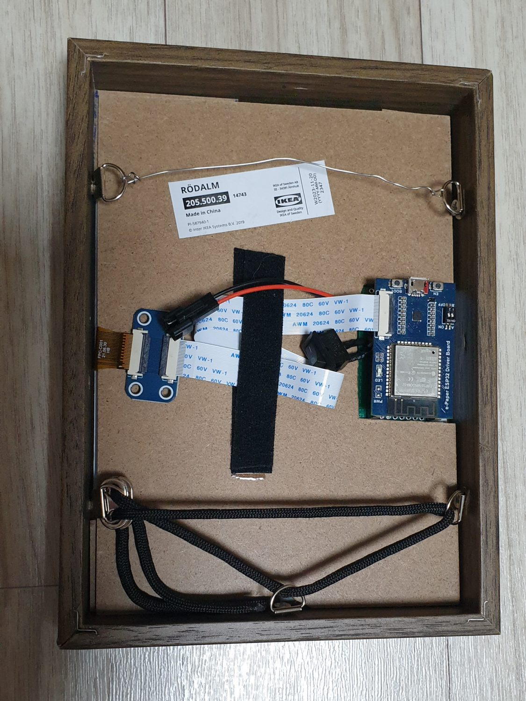

# ESPHome-eInk-Boards
These projects are meant to display Weather conditions or Tasks using various Home Assistant integrations on eInk Boards running ESPHome.




# Home Assistant

## Sensors

The Devices rely on using template sensors. If you haven't split your `configuration.yaml` yet, now isn't such a bad time to start because this will add hundreds of lines!

Put this in your `configuration.yaml`:

```
template: !include template.yaml
```

Anything in `configuration.yaml` under the `template:` heading must now be moved to `template.yaml`. Take a quick look [here](https://community.home-assistant.io/t/) for some examples on an easy way to format `template.yaml`.

#### WeatherBoard

My Weatherboard code if heavily derived from Madelena Mak's [Weatherman Dashboard](https://github.com/Madelena/esphome-weatherman-dashboard) and even more so from Stephan Wijman's updates on his [blog](https://blog.wijman.net/e-ink-weather-frame-with-esphome-and-home-assistant/).  Big thanks to both.

This relies on the OpenWeatherMap integration to function.  In its unedited form, requires 2 services: `openweathermap` (onecall_daily) and `openweathermap_hourly` (onecall_hourly). Read more about that [here](https://www.home-assistant.io/integrations/openweathermap). You may need to use 2 different locations (just make it slightly different).

My YAML uses 2-hour increments to the hourly forecast.  Look for the [0], [2], [4], [6] patterns in the code if you wish to adjust this.  There are also notes in the code about how to change the datestamp if you don't prefer the formats I use.  Other than those 2 points, there should not be much editing of the code to make it functional.  Except, of course, for the waketimes.  See the notes below.

[`HomeAssistant_template_tasks.yaml`](HomeAssistant_template_tasks.yaml)

#### TasksBoard

This code is inspired by the above code but is dramatically different in many ways.

This uses Home Assistant's inbuilt todo lists as a base.  Start with the shopping list if you must [here](https://www.home-assistant.io/integrations/shopping_list).  It can also use the official Google Tasks integration. Read more [here](https://www.home-assistant.io/integrations/google_tasks).  It can also use the official Google Calendar integration.  Read more [here](https://www.home-assistant.io/integrations/google). And of course, it can very likely use other integrations as well.  I'd encourage you if you figure out how, to post your solution somewhere so you can help other people!

Unlike the WeatherBoard code, you will need to carefully edit certain sections of this to match what integrations you use, and the names of the lists and calendars you wish to appear, and how.  Notes in the Jinja code look like this: `{# comment #}` and should be pretty helpful.

Certain events like holidays (which are pulled from a calendar), I wish only to appear on the top TO DO and never in UPCOMING, while other things will appear in UPCOMING but never in TO DO.  Some things are pulled from certain to do lists and you may wish the board to indicate which list it's from (ie. "Check Oil" on the "Car Tasks" list may appear as "Car: Check Oil" on the board).

[`HomeAssistant_template_tasks.yaml`](HomeAssistant_template_tasks.yaml)

#### Waketimes

Companion to the data sensors above (and included in the YAMLs) are the Waketime sensors.  The ESPHome will use deepsleep mode to preserve battery life.  As long as deepsleep is enabled (ie. not specifically disabled by the Helpers), the devices will enter deepsleep (using almost no power) in-between screen refreshes.  I have not tested the 10000mAh batteries fully but I expect for them to last about a year on a single charge.

Each of these sensors starts with a variable section wherein the daily wakeup schedule is entered as a list.  Edit, remove, add lines like this `` as you need to.  Home Assistant will update an attribute of this sensor every minute with a calculation of how many seconds there are between the current time and the next wake time.  Because this sensor is only updated every minute, the board will not be 100% accurate regarding its wakeup schedule, usually waking up about a minute earlier than expected (this is why all the times actually end with a 1).

The thing to keep in mind here is that although the wakeup schedule is controlled by Home Assistant, the device will not be aware of the next wakeup time until it actually wakes up again. If, for some reason, you reset the device (ie. by pulling the battery or pressing the BOOT button the ESP32), the board will update immediately and refresh the display and go back to sleep until it's next scheduled wakeup time according to whatever number of seconds Home Assistant has calculated for it.

## Helpers

Create two helpers in the Devices & Services for each device.  These below names are how I use them in the ESPHome YAML later but you can (of course) use other names but be sure to edit the ESPHome YAML to match your sensor names.

The Disable Deep Sleep helper may be used to keep the ESP board from entering deep sleep mode. Useful for calibrating the battery or if you are planning on running from USB power.

The Disable Update helper is used to avoid screen refreshing. It is useful to have an automation turn it on and off, depending on who is home (no point in wasting a screen refresh if no one will see it).

#### WeatherBoard
```
input_boolean.eink_weatherboard_disable_deep_sleep
input_boolean.eink_weatherboard_disable_update
```
#### TasksBoard
```
input_boolean.eink_tasksboard_disable_deep_sleep
input_boolean.eink_tasksboard_disable_update
```

# ESPHome

#### WeatherBoard

Because the YAML has plenty of notes scattered throughout it, I won't waste space here.  Go through the YAML carefully and edit it according to your needs.

[`ESPHome_eink-weatherboard.yaml`](ESPHome_eink-weatherboard.yaml)

#### TasksBoard

A note here that the list is somewhat dynamic.  As more TO DO tasks are displayed, the UPCOMING list is pushed further down and will not attempt to display items that do not fit.  If no TO DO items are available, it will have a default "Nothing today!" message that you may wish to edit.  Again, there are plenty of notes scattered throughout the YAML so check it carefully.

Please note that as you can see in my above example, I have an unknown character appear. I live in Korea and that should be a Korean Won symbol (₩).  It is not displayed correctly because it does not exist in the font.  There's nothing to do about this without changing the font to one which supports this character.  It's ugly but shouldn't happen often.  ESPHome is also limited by Pillow on how many glyphs may be included (undocumented but I believe it's 255) so there's almost no chance of using Asian languages here.

[`ESPHome_eink-tasksboard.yaml`](ESPHome_eink-tasksboard.yaml)

# Building

### Materials List
- Waveshare 7.5inch Three-color e-Paper Display: https://www.aliexpress.com/item/32833402189.html
- Waveshare Universal e-Paper Driver Board (ESP32 version): https://www.aliexpress.com/item/32953365564.html
- IKEA RÖDALM 13x18cm (5x7 inch) Frame (3.2cm / 1.25inch depth): https://www.ikea.com/kr/en/p/roedalm-frame-walnut-effect-20550039/
- 3x7mm PCB with 2.54mm pitch 3.7V 10000mAh: https://www.aliexpress.com/item/32330593301.html
- SM-2P & SM-2R connectors: https://www.aliexpress.com/item/33003863385.html
- 33K and 100K resistors
- 16V 1000UF capacitor (optional)
- Female sockets from an ESP8266 D1 Mini or similar
- 1260110 Rechargeable Lithium Polymer Battery (3.7V 10000mAh): https://www.aliexpress.com/item/1005006162769300.html
- 3.7V Battery LED Digital Voltmeter (1S 3.7V): https://www.aliexpress.com/item/32848280207.html
- TP4056 Battery charger (USB C): https://www.aliexpress.com/item/32836046028.html

## Waveshare E-Paper ESP32 Driver Board


When using most larger, newer displays, the switches should both be in the ON position.  Check the specs to be sure.  I also recommend removing the PWR LED with a blob of solder.  It stays on, even when the device is in deepsleep mode.  It isn't controlled by a GPIO.

Here's how to open the connector: lift up the darker lever with your fingernail (be gentle). To close it again, push down gently.


## Power Board


This board is used to allow the ESP32 to monitor the battery power as well as make disconnecting the ESP32 Board and battery easy.

The board allows battery monitoring by connecting  a 33K resistor between the 5V input pin and the ADC pin (GPIO34) and then a 100K resistor from ADC to ground.  I also added a 1000uF capacitor between the 5V pin and ground. This seems to help ESP32s that may have trouble booting from a sagging battery.  And of course, battery connections to the 5V input pin and ground.

The sockets are extras included with D1 Minis but I'm sure any sockets that have a 2.54 pitch will work fine.  I also pulled out every pin next to a used pin in the sockets, mostly because on my first attempt, I shorted 5V to CMD which resulted in the board not booting.  I left about 4/8 pins intact for stability.

A lot of the connections are made under the board by using the legs of the resistors and capacitors to meet the ends of the socket pins (which were then clipped and soldered to make them roundish).  I used half of a resistor leg to hold the battery connector lead in place.

## Charger


So simple, right?  This allows you to check the approximate power of your battery as well as charging it.  It's molasses-in-January speed charging but it works and it's extremely safe, simple, and compact.  I doubt anyone will do something so silly as this but I'm including it to show my own preference.  It is held together by 2-stage epoxy glue.

## Alignment


First you'll need to align the display.  The ESPHome YAML includes some rectangles you can uncomment to get some alignment rectangles.  Line it up as such and then carefully flip it and put some masking tape down to keep it that way.


## Building


Carefully remove all the extra hooks and stand from the backboard.  Then use a knife to make a cutout in the backboard a bit larger than the ESP32 board. This allows the power board to sit under the backboard and keep the ESP32 in place. A small cutout in the center at the bottom will allow the board to be removed and get around the D-ring that will be screwed in.  The D-rings are about 1cm down and it's recommended to put the D-rings in the frame before continuing and make sure this backboard can be removed easily.  Otherwise, the D-rings will lock the backboard in place.  Also, drilling the holes for the D-rings can make dust that can easily work its way in between the e-ink screen and the clear plastic.  Use a dust-blower if you can.


The stand that you took off the backboard can be used as shims to keep the e-ink screen and matte aligned inside the frame itself.  Flip it around and check it's straight before taping it all down.  I used 3M 233+ automotive tape because it seems to stick pretty well. Scotch tape and box tape are not recommended here.

This also allows the power board so some space so it isn't squished in-between the e-ink screen and the backboard.  I also put some sticky felt down to keep the bottom pins of the power board from scratching the back of the e-ink screen. If you don't have felt, I recommend corrugated cardboard or thin foam.



The power board should fit about here.



Here's where everything finally comes together.  The lace-pattern of the paracord shows a place to put in that big 10000mAh battery as well as the velcro I use to hold the ribbon cable down.  You could use tape here too.  I'm pretty happy with how the battery is held in place but I'm still trying to figure out if this is the best way to hang it to the wall.  There's a clear shot of the "showlace tightener" I use to pull the paracord tight.

## Update History

| Date       | Release Notes    |
| ---------- | ---------------- |
| 2024.05.25 | First release    |

## Useful Links

The Waveshare E-Paper ESP32 Driver Board: https://www.waveshare.com/wiki/E-Paper_ESP32_Driver_Board

An long, ongoing thread regarding support for 3-color displays in ESPHome: https://github.com/esphome/feature-requests/issues/239

Madelena Mak's Weatherman Dashboard : https://github.com/Madelena/esphome-weatherman-dashboard

Stephan Wijman's Weatherframe: https://blog.wijman.net/e-ink-weather-frame-with-esphome-and-home-assistant/

How to use the "new" way to call services in dev tools: https://community.home-assistant.io/t/debugging-templates-and-service-response-variables/617997

Paviro's ESPHome ePaper Calendar: https://github.com/paviro/ESPHome-ePaper-Calendar